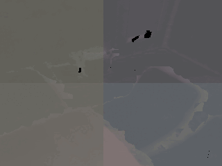

# NSLF-OL

This repository contains the implementation of our **RAL 2023** paper: 

<ins>**Online Learning** of **Neural Surface Light Fields** alongside Real-time Incremental **3D Reconstruction**</ins>

[Yijun Yuan](https://jarrome.github.io/), [Andreas Nüchter](https://www.informatik.uni-wuerzburg.de/space/mitarbeiter/nuechter/)

[Preprint](http://arxiv.org/abs/2305.00282) |  [website](https://jarrome.github.io/NSLF-OL/)


<p align="left">
  
</p>

*Come [here](https://github.com/Jarrome/NSLF-OL#3-demo) to get this demo.*

---

## 0. Install
```
conda create -n NSLF-OL python=3.8
conda activate NSLF-OL

pip install torch==1.13.0+cu116 torchvision==0.14.0+cu116 torchaudio==0.13.0 --extra-index-url https://download.pytorch.org/whl/cu116
pip install pygame==2.1.2 # dont 2.3.0, will cause problem!
pip install open3d numba opencv-python trimesh
```

## 1. Prepare data
* [ICL-NUIM](https://www.doc.ic.ac.uk/~ahanda/VaFRIC/iclnuim.html), for example, [lrkt0n](http://www.doc.ic.ac.uk/~ahanda/living_room_traj0n_frei_png.tar.gz)
* [Replica](https://github.com/cvg/nice-slam/blob/master/scripts/download_replica.sh)

*Please edit the sequence path in `[config.yaml]` correspondingly!*

## 2. How to use
### 2.1 Online learn the NSLF alongside Di-Fusion
```
python nslf_ol_vr.py [config.yaml]
```
Note that:
* `[config.yaml]` examples are located in `./configs/`
* First time run will cause some time to compile `c/cuda` code, please use `ps` or `top` to find. Afterwards would be fast!
* It will open a **pygame** window for visualization (`240x320` by default, feel free to edit it in `nslf_ol_vr.py:L137`)

*Please use keyboard*
```
****w*****    ****^*****
**a*s*d***    ****|***** 
**********    <--*v*-->*
```
*for turning and moving!*

*(pygame view will only change once keyboard control is raised.)*
* vis during train now only support non-thread inference. 

### 2.2 Online learning without vis
```
python nslf_ol.py [config.yaml]
```
* We also provide `_nosurface.py` for only nslf and `_multiGPU.py` for multiple GPUs.


### 2.3 Vis after train
```
python vr.py [config.yaml]
```
* vis after train support multi-thread inference. Thus ought to be supper fast


## 3. Demo
```
python nslf_ol_vr.py configs/replica/replica_office0.yaml
```
or
```
python nslf_ol.py configs/replica/replica_office0.yaml
python vr.py configs/replica/replica_office0.yaml
```

## 4. TODO
- [x] Add data demo
- [x] Realize on-train visualization!
- [ ] An easy to use nslf API to work in other reconstruction models.

Code contribute to this repository is always welcome!

## Acknowledgement
This project is on top of [Di-Fusion](https://github.com/huangjh-pub/di-fusion) from Jiahui Huang, [torch-ngp](https://github.com/ashawkey/torch-ngp) from Jiaxiang Tang. We thank for the open release of those contribution.

## Citation
If you find this code or paper helpful, please cite:
```bibtex
@article{yuan2023online,
  title={Online Learning of Neural Surface Light Fields alongside Real-time Incremental 3D Reconstruction},
  author={Yuan, Yijun and N{\"u}chter, Andreas},
  journal={IEEE Robotics and Automation Letters},
  year={2023},
  publisher={IEEE}
}
```

## Contact
Feel free to contact Yijun for any questions or comments. :D
